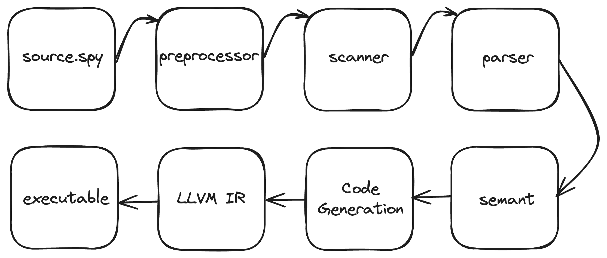

# S-Python Final Project
## Introduction
S-Python, a project aimed at introducing the concept of static typing and compilation to coding beginners, leverages Python as the first programming language for kids today, akin to how Logo and Scratch once served as entry points. This initiative brings forth several notable benefits:
Firstly, by embracing static typing and compilation, S-Python enables compilers to identify potential issues arising from type mismatches early in the development cycle, thereby mitigating the risk of runtime errors. This preemptive approach enhances the reliability and robustness of codebases.
Moreover, the explicit type declarations and strict type rules inherent in S-Python enhance code readability. Developers can easily discern the expected types of variables and function parameters, fostering clarity and comprehension within the codebase.
Static typing also contributes to long-term code maintainability by reducing the likelihood of subtle bugs associated with type mismatches. This aspect simplifies code comprehension and modification, facilitating smoother software evolution over time.
Additionally, S-Python's adoption of a compiled language offers performance advantages compared to interpreted languages. Compilation optimizes code execution, leading to enhanced program efficiency and responsiveness.
In essence, S-Python's integration of static typing and compilation not only equips beginners with foundational programming concepts but also instills best practices for code reliability, readability, and performance optimization.
## Language Tutorial
1. Installation: 
* Install Docker on your operating system, see Get Docker for more information. 

* Obtain the latest version of S- Python from Github:
    ```console
    git clone https://github.com/LeslieChn/spython.git
    ```
* Build the Docker image: 
    ```console
    docker build -t spython .
    ```
* Launch the Container:
    * for **Mac/Linux** users:
    ```console
    docker run -v $PWD:/plt2024 -it spython
    ```
    * for **Windows** users:
    ```console
    docker run -v %cd%:/plt2024 -it spython
    ```
* Run Makefile to install: 
    ```console
    make
    ```
* Compile the source file: 
    ```console
    ./spython source.spy [-o output]
    ```
* Run the executable: 
    ```console
    ./output
    ```
2. Basics:
S-Python uses indentation to define code blocks. Here's a simple "Hello, World!" program:
    ```py
    print("Hello, World!")
    ```
3. Variables and Data Types:
S-Python is static typed, meaning you must declare variable types explicitly. Common data types include boolean, characters, integers, floats, strings, and lists.
    ```py
    bool t = true
    char c = "b"
    int x = 10
    float y = 3.14
    str name = "Alice"
    int my_list = [1, 2, 3]
    ```
4. Control Structures:
S-Python supports common control structures like if statements, for loops and while loops.
    ```py
    if x > 5:
        print("x is greater than 5")
    else:
        print("x is less than or equal to 5")
    for int num in my_list:
        print(num)
    while x > 0:
        print(x)
        x -= 1
    ```
5. Strings:
Strings are sequences of characters and support concatenation operation.
    ```py
    message = "Hello, " + "Chris"
    print(message)
    ```
6. Lists:
Lists is used to store collections of items of the same type, and it's mutable.
    ```py
    my_list = [1, 2, 3]
    my_list[1] = 4
    ```
7. Functions:
    ```py
    def add(int a, int b)->int:
        return a + b
    add(1, 2)
    ```
## Architectural Design

1. Proprocessor:
The indentation of each line defines the scope of statement blocks. This unique feature of Python's syntax is known as the "off-side rule" or "indentation-based scoping." Code blocks are defined by their indentation level relative to the surrounding code. Each increase in indentation level signifies the beginning of a new block, and each decrease in indentation level signifies the end of a block. If the end of a block's indentation level can't find a previous beginning indentation level, an indentation error occurs. 

2. Lexical Analysis:
The process begins with lexical analysis, also known as scanning. This stage involves breaking down the source code into a stream of tokens. These tokens are the smallest meaningful units in the programming language, such as keywords, identifiers, constants, and operators.

3. Syntax Analysis:
After lexical analysis, the compiler proceeds to syntax analysis, also referred to as parsing. Here, the compiler verifies whether the sequence of tokens conforms to the rules defined by the language's grammar. This stage typically employs techniques like recursive descent parsing or LALR parsing to build a parse tree representing the syntactic structure of the program.

4. Semantic Analysis:
Semantic analysis follows syntax analysis and focuses on the meaning of the code. This stage checks for semantic correctness, such as type compatibility, undeclared variables, and adherence to language-specific rules. Semantic analysis often involves building and traversing abstract syntax trees (ASTs) to perform type checking and symbol resolution.

5. Intermediate Code Generation:
Once the source code has been validated syntactically and semantically, the compiler generates an LLVM intermediate representation (IR) of the program. This IR serves as an intermediate step between the high-level source code and the target machine code. Common intermediate representations include three-address code, abstract syntax trees, and control flow graphs.

7. Use Clang to assemble LLVM IR into into machine-readable code - executable file. 

## Test Plan
* positive test
A positive test is designed to validate that a system behaves as expected when provided with valid inputs. It ensures that the software meets its functional requirements under normal operating conditions.

* negative test
Negative testing involves providing invalid inputs or unexpected conditions to the software to verify that it handles errors gracefully. It helps identify vulnerabilities, boundary conditions, and error handling capabilities of the software.

* stress test
Stress testing assesses the system's behavior under extreme conditions, such as high traffic, heavy loads, or resource exhaustion. It identifies performance bottlenecks, scalability issues, and the system's breaking point.

## Summary
* State who did what
* Each team member should explain his or her most important takeaways from working on this project
* Include any advice the team has for future teams
    1. Understand the Problem Domain: Before implementing, ensure you thoroughly understand the problem domain. Familiarize yourself with compiler theory, parsing techniques, and language design principles.
    2. Break it Down: A compiler is a complex system composed of several stages (lexical analysis, parsing, semantic analysis, optimization, code generation, etc.). Break down the project into smaller, manageable tasks. This makes it easier to tackle and allows for incremental progress.
    3. Understand OCaml's Role: OCaml's concise syntax, robust pattern matching, strong typing, and functional paradigm simplify complex algorithms. In the context of compiler development, OCaml's ecosystem accelerates development. Its educational value for compiler concepts is profound, making it an ideal choice. It's important to note that OCaml is not just a programming language but a powerful tool that can significantly enhance your compiler development process.
    4. IDE configuration: The disparity between different versions of OCaml LLVM can be significant, potentially leading to compatibility issues with updated operating procedures. Leveraging Docker for the project's foundation provides a consistent and isolated environment, ensuring compatibility and simplifying setup across different systems.
    5. Test, Test, Test: Testing is crucial for ensuring the correctness and reliability of your compiler. Develop a regression testing suite that can ensure your incremental development process.
